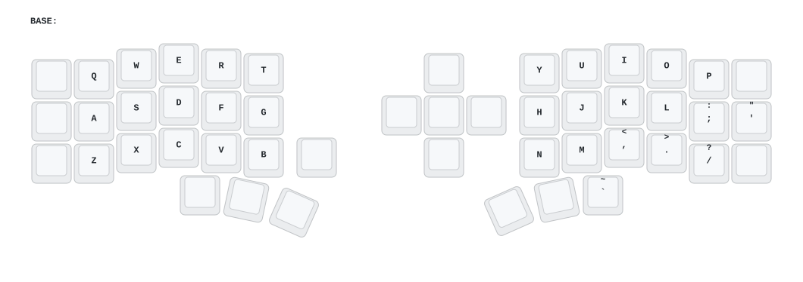

# Eyelash Corne — ZMK config

Personal ZMK firmware config for the **Eyelash Peripherals Corne** (nice!nano v2 + nice!view, EC11 encoder on the left half, 5-way switch on the right).

> This is **not** [foostan's Corne](https://github.com/foostan/crkbd) and will **not** work with standard `corne` firmware. Board definition comes from [a741725193/zmk-new_corne](https://github.com/a741725193/zmk-new_corne), pinned by commit in [`config/west.yml`](config/west.yml).

Tuned for **Windows**.

## Keymap



| Layer | Held by | Contents |
|---|---|---|
| 0 · BASE | — | Plain QWERTY + the 5-way as arrows/enter. Encoder = volume |

That is the whole keymap. It was cut back to a single layer to chase a pairing
and display fault — see `fix: strip to a minimal single-layer baseline`. There
are no combos, tap-dances, mouse keys or layer-taps right now, so **no soft-off
combo** either: power the halves down with the physical switches.

Keys this keymap therefore cannot send at all: `capslock`, `rightalt`,
`rightshift`, the digit row, and `F1`-`F12`. Worth knowing before you bind a
host-side tool (AutoHotkey, mousemaster) to any of them.

## Building

Push to `main` — GitHub Actions builds it. All four `.uf2` files land in a
single artifact named `firmware`:

| `.uf2` | Flash to |
|---|---|
| `eyelash_corne_left nice_view-…` | Left half |
| `eyelash_corne_right nice_view-…` | Right half |
| `eyelash_corne_studio_left` | Left half instead of the plain left build, for live keymap editing — see [ZMK Studio](#zmk-studio) |
| `settings_reset-…` | Both halves, to clear pairings when they won't connect |

## Flashing

```powershell
.\scripts\flash.ps1                      # left + right, latest green build on main
.\scripts\flash.ps1 -Target studio,right # Studio-enabled left, then right
.\scripts\flash.ps1 -Target reset        # clear pairings (run once per half)
.\scripts\flash.ps1 -DownloadOnly        # fetch and show paths, touch no drive
```

The script finds the latest successful build, downloads the `firmware`
artifact (cached per run under `%TEMP%\kw-corne-fw`), waits for you to
double-tap reset, and copies the right `.uf2` across. It only ever writes to a
volume **labelled `NICENANO`** — it takes no drive letter, so it cannot be
aimed at the wrong disk. Needs PowerShell 7 and an authenticated `gh`.

Doing it by hand instead: download `firmware` from the run, double-tap reset on
a half, drag the matching `.uf2` onto the `NICENANO` drive. It dismounts itself.
Repeat for the other half.

If the halves won't pair, flash `settings_reset` to **both** first, then flash
the real firmware.

## ZMK Studio

Flash `eyelash_corne_studio_left` to the left (central) half, plug it in over
USB, and open <https://zmk.studio>. Keybinds become editable live — no rebuild,
no reflash, no double-tap reset.

`CONFIG_ZMK_STUDIO=y` comes from the shield's own `eyelash_corne_left.conf`
upstream, along with the whole RPC stack. That is also why `config/west.yml`
pins **cormoran's** ZMK fork rather than stock `zmkfirmware/zmk`. The
`studio-rpc-usb-uart` snippet in `build.yaml` is the part that adds the USB
transport Studio connects over; without that build entry there is nothing
listening.

Two things to know before you rely on it:

- **Studio edits live in the settings partition, not this repo.** Change a
  binding in Studio and `config/eyelash_corne.keymap` is now a lie. Treat Studio
  as the scratchpad, then commit the same change here. A plain app reflash keeps
  the settings partition; flashing `settings_reset` wipes every Studio edit.
- **Locking is off** (`-DCONFIG_ZMK_STUDIO_LOCKING=n`). Any host you plug the
  keyboard into can rewrite the keymap without an unlock keypress. Turning
  locking on needs a bound `&studio_unlock` key, and the single-layer keymap has
  no free position for one.

## Repo settings this depends on

`.github/workflows/draw.yml` regenerates the keymap diagram and commits it back, so **Settings → Actions → General → Workflow permissions** must be set to **Read and write permissions**.

## Credits

- Board + hardware: [a741725193/zmk-new_corne](https://github.com/a741725193/zmk-new_corne)
- Firmware: [ZMK](https://zmk.dev) `v0.3.0`
- Diagram: [caksoylar/keymap-drawer](https://github.com/caksoylar/keymap-drawer)
